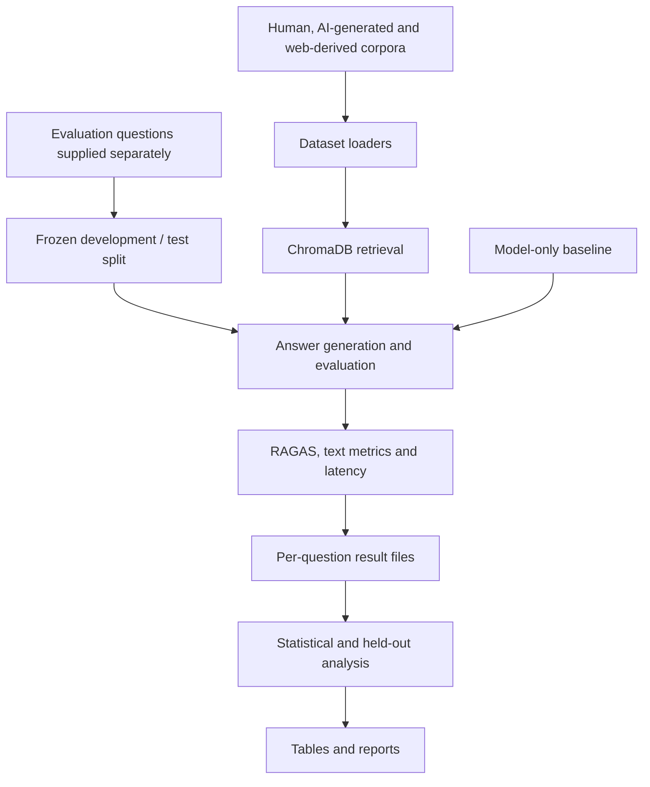

# Quitxt Eval

Research code for comparing retrieval-augmented generation configurations in smoking-cessation question answering.

This repository contains the evaluation and analysis portion of the Quitxt benchmarking study. It compares model-only answers with answers grounded in human-curated, AI-generated, and web-derived knowledge bases, then analyzes answer quality, latency, and uncertainty.

**Status:** research code with a runnable synthetic onboarding example. Study datasets, raw results, and per-run logs are not included; the existing study documentation makes them available from the corresponding author on reasonable request. The messaging application is a separate project.

[Try the synthetic example](#try-the-synthetic-example) · [Method](#evaluation-design) · [Architecture](#architecture) · [Study setup](#study-setup) · [Code guide](#code-guide)

## Try the synthetic example

This entry point uses **Python 3.12** and [uv](https://docs.astral.sh/uv/getting-started/installation/), two small analysis dependencies, and no provider accounts or study files. It calls the repository's actual workbook loader, frozen-split guard, summary statistics, and paired non-inferiority/equivalence functions. Outbound socket connections are blocked while it runs.

```bash
git clone https://github.com/anudeepadi/quit-txt-rag-eval.git
cd quit-txt-rag-eval
uv venv --python 3.12 .venv
source .venv/bin/activate
uv pip install -r examples/requirements.txt
python examples/synthetic_evaluation.py
```

The [script](examples/synthetic_evaluation.py) creates a temporary workbook with invented, nonmedical questions. It removes one flagged row, checks a 50/10 split with no overlap, confirms that held-out access is blocked during optimization, then analyzes [hand-authored score fixtures](examples/synthetic_scores.json). It never reads or changes the study workbook or its manifest.

| Synthetic fixture | n | Mean score | SD |
| --- | ---: | ---: | ---: |
| AI RAG fixture | 10 | 0.8060 | 0.0896 |
| Human RAG fixture | 10 | 0.8130 | 0.0673 |

See the [complete output](examples/synthetic-results.md). These numbers are **not study findings**, generated answers, or RAGAS measurements. The example checks analysis plumbing; it does not compare model quality. The illustrative 0.05 margin is not a clinically justified study margin.

## Evaluation design

- **Quality:** RAGAS faithfulness, answer relevancy, and context precision/recall, with additional BERTScore and traditional NLP metric scripts.
- **Performance:** latency comparisons across retrieval configurations.
- **Statistical analysis:** significance tests, confidence intervals, and held-out non-inferiority/equivalence analysis.
- **Contamination control:** a frozen development/test split separates questions used for optimization from final evaluation.
- **Reporting:** scripts assemble result tables and manuscript-oriented reports from saved outputs.

The split module defines 50 development and 77 held-out questions from 127 clinically filtered questions. These counts describe the recorded design, not a new benchmark run. The held-out analysis explicitly addresses earlier optimization/evaluation overlap and distinguishes “not statistically different” from evidence of equivalence.

## Architecture



The scripts implement related experiments rather than a single production service. Baseline generation bypasses retrieval; held-out reanalysis consumes saved scores and does not call a model provider.

## Study setup

The full experimental environment in [requirements.txt](requirements.txt) is separate from the tested minimal walkthrough above. Dependencies are mostly unpinned; review compatibility and retain an environment snapshot with any reproduced experiment. A fresh provider-backed study run has not been verified in this documentation refresh.

```bash
git clone https://github.com/anudeepadi/quit-txt-rag-eval.git
cd quit-txt-rag-eval
python3 -m venv .venv
source .venv/bin/activate
python -m pip install -r requirements.txt
cp code/.env.example code/.env
```

Configure `OPENAI_API_KEY` for provider-backed evaluation. Before executing experiments, obtain the required corpora and question workbook and place them in the paths expected by [data_loader.py](code/shared/data_loader.py) and [ragas_utils.py](code/shared/ragas_utils.py). A fresh clone cannot reproduce the study's numbers without those inputs.

### Evaluation example

After supplying data and credentials, run from `code/`:

```bash
cd code
python scripts/ragas_evaluation.py --split dev --max-questions 20 --configs baseline human_rag
```

This uses the development split for a bounded diagnostic run, not final held-out reporting. Read [the script guide](code/scripts/README.md) for resume, concise-mode, and latency options. Model-backed runs incur provider usage.

For reanalysis of existing scores, inspect the accepted arguments without starting an evaluation:

```bash
python scripts/holdout_noninferiority.py --help
```

That script accepts `--result-json`, `--test-set`, `--n-questions`, and `--margin`. Choose and record the non-inferiority margin before interpreting results.

## Code guide

| Path | Responsibility |
| --- | --- |
| [code/scripts/ragas_evaluation.py](code/scripts/ragas_evaluation.py) | Main multi-configuration RAGAS evaluation |
| [code/scripts/latency_comparison.py](code/scripts/latency_comparison.py) | Timing comparisons |
| [code/scripts/statistical_tests.py](code/scripts/statistical_tests.py) | Statistical analysis |
| [code/scripts/holdout_noninferiority.py](code/scripts/holdout_noninferiority.py) | Overlap removal and equivalence/non-inferiority analysis |
| [code/shared/question_split.py](code/shared/question_split.py) | Frozen question split and optimization guard |
| [code/data/test_set/question_split_manifest.json](code/data/test_set/question_split_manifest.json) | Recorded split metadata |
| [docs/methodology_and_review_detail.md](docs/methodology_and_review_detail.md) | Methodology and review context |
| [paper/](paper/) | Report-generation scripts |

## Interpretation and reproducibility

These are model-output evaluations in a health domain, not evidence of clinical effectiveness. Changes to prompts, model versions, retrieval corpora, question sets, and evaluators can change the result. Report those settings and preserve per-question outputs with any claim.

Some auxiliary reports require dependencies beyond the main requirements file. Review each script's imports and input paths before using it. No new experimental result is claimed by this README.

For contributions, describe the methodological consequence of a change, preserve the frozen split, and distinguish implementation corrections from changes to the experimental protocol.

## License

[MIT](LICENSE). Dataset access and permissions are separate from the code license.
